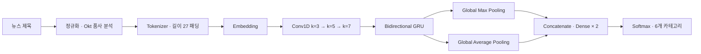

# Korean News Headline Category Classification

> **뉴스 제목만으로 6개 섹션을 분류하는 한국어 텍스트 분류 실험**  
> 전처리의 정보 손실을 줄이고, 짧은 문장에 맞춘 `Conv1D + BiGRU` 모델을 설계한 뒤 **54개 조합을 최신 헤드라인으로 검증**하였다.

<p>
  
  
  
  
</p>

## 프로젝트 한눈에 보기

| 항목 | 내용 |
| --- | --- |
| 문제 | 한국어 뉴스 제목을 `Politics`, `Economic`, `Society`, `World`, `Culture`, `IT_Science` 중 하나로 분류 |
| 학습 데이터 | 네이버 뉴스 섹션 원천 제목 14,668건 (2026-06-05, 2026-06-08) → 레이블 충돌 제목 29건 제외 후 **14,639건** 사용 |
| 내부 검증 | 학습/검증 90:10 분할 (13,175건 / 1,464건) |
| 시간 분리 평가 | 학습 기간 이후의 최신 헤드라인 270건 수집 → 중복 제거 후 **266건** 평가 (2026-06-10) |
| 최종 모델 | Model 1 · embedding 768 · batch 192 · class weight 적용 |
| 최종 성과 | 최신 헤드라인 정확도 **66.17%** · 내부 검증 정확도 75.00% |

내부 검증 정확도와 최신 헤드라인 정확도는 일치하지 않았다. 내부 검증 최고 모델은 76.37%였지만 최신 헤드라인에서는 63.91%였고, 최종 모델은 내부 검증 75.00%, 최신 헤드라인 **66.17%**를 기록하였다. 최종 모델은 최신 헤드라인 평가 결과를 기준으로 선택하였다.

상세 실험 근거는 [모델 개선 보고서](docs/%EB%89%B4%EC%8A%A4%20%EA%B8%B0%EC%82%AC%20%EC%A0%9C%EB%AA%A9%20%EC%B9%B4%ED%85%8C%EA%B3%A0%EB%A6%AC%20%EB%B6%84%EB%A5%98%20%EB%AA%A8%EB%8D%B8%20%EA%B0%9C%EC%84%A0%20%EB%B3%B4%EA%B3%A0%EC%84%9C.docx)에서 확인할 수 있다.

## 문제 정의와 접근

뉴스 제목은 본문보다 짧지만 `검찰 수사`, `반도체 투자`, `증시 하락`처럼 카테고리를 가르는 표현이 밀집해 있다. 따라서 긴 문맥을 여러 층으로 누적하는 방식보다, 여러 길이의 핵심 구문과 제한적인 순서 정보를 함께 잡는 방향으로 모델을 개선하였다.



## 개선한 지점

| 관찰한 한계 | 적용한 개선 | 설계 의도 |
| --- | --- | --- |
| 한글·영어만 남기고 한 글자 토큰을 모두 제거 | 숫자와 한자를 보존하고, `Okt.pos(norm=True, stem=True)` 기반 품사 필터링 적용 | 한자 약어와 숫자 등 제목의 분류 단서 보존 |
| 3층 LSTM + `MaxPooling1D(1)` + `Flatten` | 3/5/7 크기의 Conv1D, BiGRU, Global Max/Average Pooling 결합 | 핵심 n-gram과 제목 전반의 문맥을 함께 반영하고 불필요한 파라미터 감소 |
| 단일 구조·단일 설정 비교 | 모델 3종 × batch 3종 × embedding 3종 × class weight 유무 | 구조와 학습 조건의 결합 효과를 비교 |
| 검증셋 정확도만으로 모델 선택 | 별도 수집한 최신 헤드라인으로 54개 모델 재평가 | 시간 변화가 있는 뉴스 분포에 더 가까운 선택 기준 확보 |

### 전처리 원칙

- 제거 품사: 조사, 어미, 기호, 감탄사, 관형사, 접미사 등 의미 기여가 낮은 토큰
- 유지 품사: 명사, 동사, 형용사, 부사, 영문, 숫자, 외국어
- 한 글자 토큰은 일괄 삭제하지 않고, 의미가 약한 일부 토큰만 제외
- 최종 어휘 사전 크기: **14,999**, 최대 시퀀스 길이: **27**

## 모델과 실험 설계

세 모델은 공통적으로 `Embedding → SpatialDropout → Conv1D × 3 → BatchNorm → BiGRU → Pooling 결합 → Dense × 2 → Softmax` 흐름을 가진다.

| 모델 | 차이점 | 최신 헤드라인 평균 정확도 | 최고 정확도 | 상위 10개 포함 |
| --- | --- | ---: | ---: | ---: |
| Model 1 | Conv/Dense에 L2 정규화를 적용하지 않은 기준 구조 | **63.45%** | **66.17%** | 4 |
| Model 2 | Conv/Dense에 L2 정규화를 적용하고 dropout 설정을 조정 | 63.18% | 65.79% | **5** |
| Model 3 | kernel 3·5 Conv 필터 수와 Dense 구성을 조정 | 62.16% | 65.41% | 1 |

학습에는 `AdamW(lr=2e-4, weight_decay=1e-5)`와 `CategoricalCrossentropy(label_smoothing=0.02)`를 사용하였다. `ReduceLROnPlateau(val_loss)`와 `EarlyStopping(val_accuracy, restore_best_weights=True)`으로 학습을 제어하였다.

### 주요 실험 결과

| 비교 축 | 가장 좋은 설정 | 해석 |
| --- | ---: | --- |
| Embedding 차원 | 768: 평균 **63.87%**, 최고 **66.17%** | 겹치는 뉴스 키워드를 구분하기 위한 표현력이 중요 |
| Batch size | 128: 평균 **63.58%** / 192: 최고 **66.17%** | 평균 안정성과 단일 최고 성능의 선택이 다름 |
| Class weight | 적용: 최고 **66.17%** / 미적용: 평균 **63.12%** | 불균형 보정이 전체 정확도를 항상 높이지는 않음 |
| 내부 검증 vs 최신 평가 | 상관계수 **0.21** | 내부 검증만으로 실전 성능을 대체하기 어려움 |

### 최종 선택 모델

```text
Model 1
├─ Embedding: 768
├─ Conv1D: 320 (k=3) → 256 (k=5) → 192 (k=7)
├─ Bidirectional GRU: 96 units
├─ Pooling: Global Max + Global Average
├─ Batch size: 192
└─ Class weight: enabled
```

| 평가 데이터 | 정확도 |
| --- | ---: |
| 내부 검증셋 (1,464건) | 75.00% |
| 최신 헤드라인 외부 평가셋 (266건) | **66.17%** |

## 데이터 파이프라인

1. `job02_crawling_data_enhanced.py`로 뉴스 섹션별 제목을 수집한다.
2. `job03_concat_data.py`에서 수집 파일을 병합하고, 레이블을 정규화한 뒤 중복을 제거한다.
3. `job04_preprocess.py`에서 Okt 품사 분석, 토큰화, 패딩 및 train/test 분할을 수행한다.
4. `job05_model_learning_combination.py`에서 54개 조합을 학습하고 결과를 `training_results.csv`에 기록한다.
5. `h5ToKeras.py`로 기존 H5 모델을 `.keras` 형식으로 변환한다.
6. `job01_crawling_headline.py`로 최신 헤드라인을 수집하고, `job06_section_predict.py`에서 모든 후보 모델을 평가해 `headline_eval_results.csv`를 생성한다.

## 실행 방법

### 1. 환경 준비

KoNLPy의 Okt 형태소 분석기를 사용하므로 Java 설치 및 `JAVA_HOME` 설정이 필요하다. `requirements.txt`에는 코드에서 사용하는 TensorFlow, Keras, KoNLPy 등 핵심 패키지가 모두 선언되어 있지 않으므로, 아래 목록으로 가상환경을 구성한다.

```powershell
python -m venv .venv
.\.venv\Scripts\Activate.ps1
python -m pip install --upgrade pip
pip install tensorflow keras numpy pandas scikit-learn konlpy matplotlib beautifulsoup4 requests selenium webdriver-manager
```

### 2. 재현 순서

```powershell
# 수집 데이터 병합 → 전처리 → 54개 조합 학습
python job03_concat_data.py
python job04_preprocess.py
python job05_model_learning_combination.py

# H5 모델 변환 → 최신 헤드라인 평가
python h5ToKeras.py
python job06_section_predict.py
```

> **주의:** 수집 스크립트의 카테고리 선택값과 날짜 기반 파일명은 코드에 고정되어 있다. 새 데이터를 수집할 때는 `job02_crawling_data_enhanced.py`, `job03_concat_data.py`, `job06_section_predict.py`의 해당 값과 경로를 먼저 맞춰야 한다.

## 저장소 구성

```text
.
├─ data/                                   # 수집 원천 데이터, 전처리 배열, tokenizer, encoder
├─ docs/
│  └─ 뉴스 기사 제목 카테고리 분류 모델 개선 보고서.docx
├─ models/                                 # 학습된 .h5 모델
├─ models_keras/                           # 변환된 .keras 모델
├─ job01_crawling_headline.py              # 최신 헤드라인 수집
├─ job02_crawling_data_enhanced.py         # 섹션별 학습용 데이터 수집
├─ job03_concat_data.py                    # 병합·정제
├─ job04_preprocess.py                     # 형태소 기반 전처리·시퀀스 생성
├─ job05_model_learning_combination.py     # 54개 조합 학습
├─ job06_section_predict.py                # 최신 헤드라인 기반 모델 비교
├─ h5ToKeras.py                            # H5 → Keras 변환
├─ training_results.csv                    # 내부 검증 결과
└─ headline_eval_results.csv               # 최신 헤드라인 평가 결과
```

## 종합 분석

- 기존 검증셋 정확도가 가장 높은 모델이 최신 헤드라인 평가에서 가장 좋은 모델은 아니었다. 최종 모델 선택에서는 validation accuracy와 별도의 최신 헤드라인 평가를 함께 고려할 필요가 있었다.
- 뉴스 제목 분류에서는 전처리 방식이 모델 품질에 영향을 주었다. 숫자와 한자 약어를 보존하고 품사 기반 필터링을 적용한 방식이 제목의 분류 단서를 유지하는 데 적합하였다.
- Embedding 768은 평균 정확도와 최고 정확도, 상위권 분포에서 가장 좋은 결과를 보였다. 단어 표현력은 정치·사회·경제·IT처럼 키워드가 겹치는 카테고리를 구분하는 데 중요한 요소였다.
- Model 2는 상위권에 자주 포함되었지만 평균과 최고 성능은 Model 1이 더 높았다. 현재 Model 2보다 약한 L2 규제를 적용한 중간 구조를 추가로 실험할 필요가 있다.
- 이후 실험에서는 전체 평균뿐 아니라 상위권 모델의 구조·batch size·embedding 차원·class weight 조합을 함께 분석할 필요가 있다.
